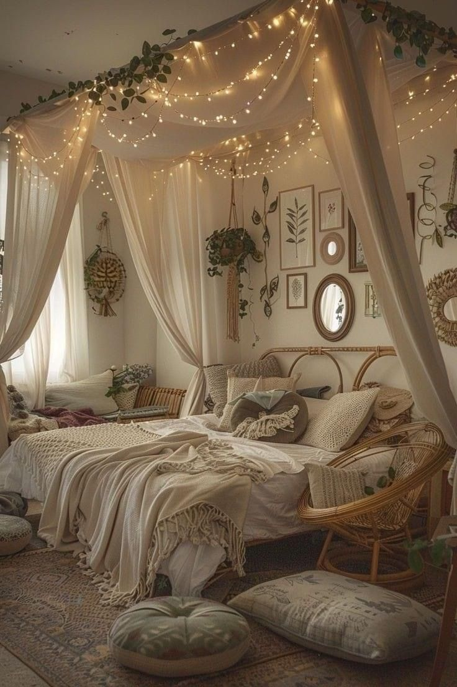

# Blog Content Planning

## Content Pillars
- Lifestyle & Wellness
- Beauty & Skincare Reviews
- Sustainable Living & Eco-Friendly Tips
- Boho Style & Decor
- Southern California Coastal Vibes

## Post Ideas
- Seasonal skincare routines
- Product reviews & recommendations
- How-to guides (e.g., creating a boho-inspired home)
- Creator tips and social media strategies
- Local spotlights & adventures in SoCal

## Posting Schedule
- Frequency (e.g., weekly, biweekly)
- Preferred publishing days/times

## Goals
- Increase engagement
- Grow Pinterest & Instagram followers
- Collaborate with brands aligned with SoCal Boho values

---

*Optional: Drafts, keywords, and SEO targets can be noted here as you build posts.*

## ==============================
   Layout
============================== ##
main {
  margin: 0 auto;
  max-width: 800px;
  padding: 1rem;
  text-align: center;
}

## ==============================
   Header & Navigation
============================== */
.logo {
  cursor: pointer;
  display: inline-block;
  font-family: 'Playfair Display', serif;
  font-size: 2rem;
  font-weight: 700;
  letter-spacing: 1px;
  margin: 0;
  padding: 0;
  text-transform: uppercase;
}

nav a {
  color: #333;
  display: inline-block;
  margin: 0 1rem;
  padding: 0.5rem 0;
  text-decoration: none;
  transition: color 0.3s ease;
}

nav a:hover,
nav a:focus {
  color: #9c7b5a;
  outline: none;
}

## ==============================
   Blog Posts & Content
============================== */
.blog-posts,
.social-pinterest {
  margin-bottom: 2rem;
}

.blog-post {
  border-bottom: 1px solid #ddd;
  margin-bottom: 2rem;
  padding-bottom: 1rem;
  text-align: left;
}

.blog-post img {
  display: block;
  margin: 0 auto 1rem;
  max-width: 100%;
  height: auto;
}

.read-more {
  background-color: #9c7b5a;
  border-radius: 4px;
  color: white;
  display: inline-block;
  margin-top: 0.5rem;
  padding: 0.5rem 1rem;
  text-decoration: none;
  transition: background-color 0.3s ease;
}

.read-more:hover {
  background-color: #755a3c;
}

## ==============================
   Cards / Picks
============================== */
.pick-card {
  background-color: #faf5f0;
  border: 1px solid #ddd;
  border-radius: 8px;
  box-shadow: 0 2px 6px rgba(0,0,0,0.1);
  margin: 1rem 0;
  padding: 1rem;
  text-align: center;
  transition: box-shadow 0.3s ease;
}

.pick-card:hover {
  box-shadow: 0 4px 12px rgba(0,0,0,0.15);
}

## ==============================
   Brand Logos / Section
============================== */
.brands {
  display: flex;
  flex-wrap: wrap;
  justify-content: center;
  margin: 2rem 0;
  gap: 1.5rem;
}

.brands img {
  max-height: 60px;
  object-fit: contain;
  transition: opacity 0.3s ease;
}

.brands img:hover {
  opacity: 0.7;
  cursor: pointer;
}

## ==============================
   Pinterest Widget
============================== */
.social-pinterest a[data-pin-do] {
  display: block;
  margin: 0 auto;
}

Add and or update
📌 Blog Post Setup: “How to Style Your Boho Bedroom”
Issue:
Both the blog title and the “Read More” button link to the same thing — feels redundant.

Fix:

✅ Step 1: Create New Blog Post File
Create /blog-posts/boho-bedroom.html

Template starter:

html
Copy
Edit
<!DOCTYPE html>
<html lang="en">
<head>
  <meta charset="UTF-8" />
  <title>How to Style Your Boho Bedroom</title>
  <link rel="stylesheet" href="../css/style.css" />
</head>
<body>
  <header> ... </header>

  <main>
    <article class="blog-post">
      <h1>How to Style Your Boho Bedroom</h1>
      
Published: June 30, 2025

      
      
[Your blog content here]

    </article>
  </main>

  <footer> ... </footer>
</body>
</html>
✅ Step 2: Update Link on /blog.html
Replace this:

html
Copy
Edit
<h2><a href="#">How to Style Your Boho Bedroom</a></h2>
<a href="#" class="read-more">Read More</a>
With this:

html
Copy
Edit
<h2><a href="blog-posts/boho-bedroom.html">How to Style Your Boho Bedroom</a></h2>
<a href="blog-posts/boho-bedroom.html" class="read-more">Read More</a>
✅ Optional UX Fix: Remove Read More Button (If Redundant)
Or hide it on desktop:

css
Copy
Edit
@media (min-width: 768px) {
  .read-more {
    display: none;
  }
}

**********************************************************************

🪴 Blog Title: How to Style Your Boho Bedroom
Meta Description: Transform your bedroom into a cozy, earthy boho retreat with these styling tips—from natural textures to thrifted finds that speak to your soul.

✍️ Outline
1. Introduction

Personal anecdote or inspiration (Why you love boho bedrooms)

What the reader can expect from this post

2. Embrace Earthy Tones & Textures

Use of warm neutrals, muted terracottas, soft pinks, or sage

Materials: rattan, linen, macramé, reclaimed wood

3. Layer with Cozy Textiles

Throws, pillows, layered rugs

Mixing patterns like global prints, kantha, mud cloth

4. Add Meaningful, Mismatched Decor

Thrifted treasures, DIY pieces, handmade pottery

Let imperfections add charm

5. Lighting That Feels Like Golden Hour

Salt lamps, fairy lights, lanterns, woven shades

Embrace soft, ambient lighting

6. Go Green with Plants

Low-maintenance plants for bedside tables or shelves

Hanging planters or vintage pots

7. Keep It Grounded & Functional

Floating shelves, baskets, under-bed storage

Boho doesn’t mean cluttered

8. Final Touch: Scents + Sounds

Candles, palo santo, diffusers with lavender or sandalwood

Consider a playlist or white noise

9. Closing Thoughts

Reiterate how small changes can transform a space

Encourage readers to start with one corner or shelf

📝 Draft
markdown
Copy
Edit
# How to Style Your Boho Bedroom

There's something grounding about walking into a space that just *feels* like you. For me, that space is my bedroom—sunlight pouring in, textures layered like stories, and the scent of palo santo still lingering in the air.

If you’re craving a space that reflects your earthy, creative soul, here are my favorite tips to style a boho bedroom that’s both calm and collected.

## 1. Embrace Earthy Tones & Natural Textures

Start with a color palette rooted in nature: creamy whites, muted rusts, sage greens, and warm browns. Then build texture—rattan headboards, jute rugs, and linen bedding are a boho bedroom’s best friends.

## 2. Layer with Cozy Textiles

Don’t be afraid to mix and match. I love layering kantha quilts over vintage throws, and pillows in varying shapes and patterns. Moroccan poufs? Yes please.

## 3. Add Meaningful, Mismatched Decor

The best part of styling a boho space is that not everything *has* to match. In fact, it shouldn’t. Add thrifted picture frames, handmade ceramics, or pieces from your travels—anything that brings joy.

## 4. Lighting That Feels Like Golden Hour

Harsh overhead lights? Nope. Boho bedrooms glow. Try fairy lights, paper lanterns, or even a rattan pendant. I keep a salt lamp by my bed for soft, warm vibes.

## 5. Go Green with Plants

Even a single pothos plant can liven up your space. I rotate mine seasonally and love hanging a few in macramé holders near the window.

## 6. Keep It Functional + Flowing

Storage can still be stylish. Think: woven baskets, low-profile dressers, or a vintage trunk at the end of the bed. Clear the clutter, but don’t lose your personality.

## 7. Final Touch: Scent & Sound

My favorite part? The ambiance. I diffuse sandalwood oil, play soft music or birdsong, and keep dried lavender in a bowl on my dresser. It’s all in the details.

---

Your bedroom is your sanctuary. Start with one shelf, one fabric, one feeling—and let your space evolve with you.

💫 Stay grounded,  
*Jylian*

📌 1. Custom Pinterest Graphic
Design specs (you can create this in Canva or I can help generate it):

💡 Design Concept:
Size: 1000 x 1500 px (Pinterest optimal)

Background: Light neutral texture (linen, plaster wall, or faded woven rug)

Overlay: Photo collage (bed with throw blanket, pampas grass, a shelf with books/plants)

Headline text (use brand font like Quicksand or Playfair):

vbnet
Copy
Edit
How to Style Your Boho Bedroom
Earthy | Cozy | Grounded
Footer/Logo: Add your “SoCal Boho” logo at the bottom center or side

Color palette: Pull soft brown, blush, beige, and white from your site's color scheme

Optional overlay sticker: “✨ Save this for later!”

🖼 2. Social Media Caption (Instagram or Pinterest Pin Description)
Here’s a caption for IG or Pinterest to drive traffic:

✨ Ready to transform your bedroom into a grounded boho retreat?
I’m sharing easy, soulful ways to bring warmth, texture, and intention into your space 🌿 Think thrifted treasures, layered textiles, and lighting that feels like golden hour.

👉 Tap to read or save for inspo later!

#BohoBedroom #SoCalBoho #HomeDecorInspo #CozyVibes #BohoHome #BedroomAesthetic #WabiSabiStyle

🛒 3. Affiliate Picks Section for Blog
Add this to the end of your blog post, under a section like:

html
Copy
Edit
<section class="affiliate-picks">
  <h3>Shop the Look</h3>
  

    

      <a href="https://www.amazon.com/dp/B09R3X6X9N?tag=yourtag" target="_blank">
        
        
Boho Throw Pillow

      </a>
    

    

      <a href="https://www.shopltk.com/explore/socalboho/posts/123456" target="_blank">
        
        
Jute Area Rug

      </a>
    

    

      <a href="https://www.amazon.com/dp/B07DKYMT8B?tag=yourtag" target="_blank">
        
        
Pampas Grass Decor

      </a>
    

  

</section>
Then style it in your CSS:

css
Copy
Edit
.affiliate-picks {
  padding: 2rem;
  background-color: #fdf7f3;
  text-align: center;
}

.affiliate-picks h3 {
  font-family: 'Playfair Display', serif;
  font-size: 1.8rem;
  color: #5a3d2b;
  margin-bottom: 1.5rem;
}

.affiliate-picks .scroll-picks {
  display: flex;
  gap: 1rem;
  justify-content: center;
  flex-wrap: wrap;
}

✅ Blog Add-ons Recap: How to Style Your Boho Bedroom
📌 Pinterest Graphic
Size: 1000 x 1500 px

Headline: How to Style Your Boho Bedroom

Theme: Earthy, soft neutrals, cozy textures

CTA overlay: “✨ Save this for later!”

🖼 Social Caption (IG/Pinterest):
✨ Ready to transform your bedroom into a grounded boho retreat?
I’m sharing easy, soulful ways to bring warmth, texture, and intention into your space 🌿
👉 Tap to read or save for inspo later!
#BohoBedroom #SoCalBoho #HomeDecorInspo #WabiSabiStyle

🛒 Affiliate Picks Section
Custom scroll cards featuring:

Throw Pillow

Jute Rug

Pampas Grass

Added to end of blog post under section.affiliate-picks